<!-- Every graphic on this page is generated from real data by scripts/ and the
     contribution graph + stats card are refreshed daily by
     .github/workflows/update-profile-art.yml. -->

<h3><code>ryuta@github ~ $ ./contributions.sh</code></h3>

 
 

<h3><code>ryuta@github ~ $ whoami</code></h3>

<table>
<tr>
<td valign="top"></td>
<td valign="top"></td>
</tr>
</table>

 
 

<h3><code>ryuta@github ~ $ ./achievements.sh</code></h3>

 
 

<h3><code>ryuta@github ~ $ cat about.txt</code></h3>

<b>Engineering Student · AI Apps · Embedded Systems · Creative Tech</b>

I build software and hardware that connect the digital and physical world: 
AI-assisted tools, sensor-driven prototypes, and clean interfaces for creators.

 

<h3><code>ryuta@github ~ $ ls ./stack</code></h3>

<code>~/stack/learning</code>

 
 

<h3><code>ryuta@github ~ $ ls ./projects</code></h3>

<b>AeroGrid-3D</b> — real-time 3D flight &amp; satellite tracking map with weather overlays 
<code>3D visualization</code> · <code>Google Cloud Run</code> · <code>AI-assisted development</code>

<b>Hardware × software prototypes</b> — sensors, microcontrollers and cloud services behind simple UIs 
<code>embedded systems</code> · <code>IoT</code> · <code>automation</code>

 

<h3><code>ryuta@github ~ $ ./links.sh</code></h3>

 
 

